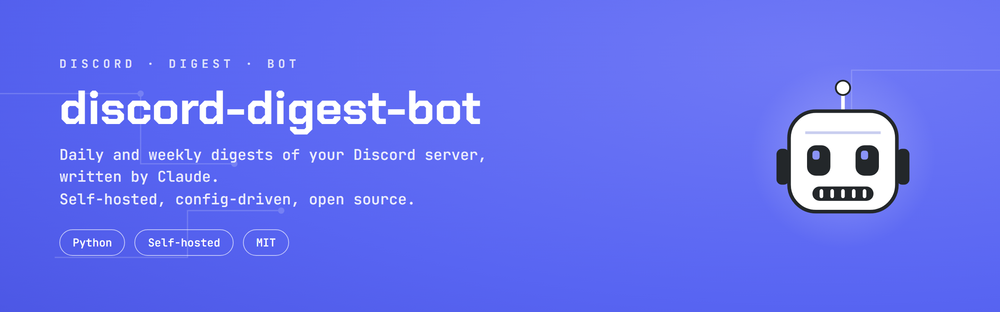

# discord-digest-bot



Your Discord server, summarized. A small bot that reads what your community talked about and posts a short summary back into the server, every day and every week.

## What it is

Discord is where a lot of communities live now, and a busy server moves fast. Dozens of channels, hundreds of messages a day, and nobody can keep up with all of it. Good conversations scroll away. Someone steps out for the weekend, comes back to a wall of backlog, and just gives up on catching up.

This bot fixes that. It sits in your server, reads the recent messages in the channels you pick, and uses Claude to write a short, readable recap of what actually happened. Then it posts that recap right back into a channel, so anyone can catch up in a minute. That recap is what I call the "digest."

It runs two ways. A daily digest covers the last day. A weekly digest covers the last week. You choose which channels it reads and which channel it posts to.

You host it yourself. You bring your own Discord bot and your own Claude API key, put them in a config file, and set it on a schedule. It's open source and free under the MIT license.

## Why it exists

I built this for my own Discord community. We got active enough that people kept falling behind, and anyone who stepped away for a few days had no easy way back in. I wanted one short post a day that said "here's what you missed," written well enough that people would actually read it.

Claude turned out to be great at this. It reads the raw chatter and writes a recap that sounds like a real person caught you up over coffee. So I cleaned the tool up, pulled everything specific to my server out into a config file, and put it here so you can run the same thing on yours.

If you run a community and you want to keep people in the loop without anyone scrolling back through a thousand messages, this is for you.

## How it works

The bot runs on a schedule. On each run it reads a window of recent messages from a configured list of channels via the Discord REST API, hands that raw message JSON to an LLM to write a readable digest, validates the result, and then either posts the digest to a target channel or writes it to a local file for review. There are two periods, `weekly` and `daily`, that share one engine and are selected with `--period`. Every server-specific value lives in a JSON config file; nothing about any particular server is hardcoded.

The `weekly` period reads a rolling window (default the last 7 days). The `daily` period reads an anchored window that snaps to a fixed clock hour (default 23:00 local), so "today" always means the same span, and it skips genuinely quiet days below a message threshold.

For each channel it reads the whole window. Discord hands back at most 100 messages per request, so the bot pages backward through a channel until it passes the start of the window or hits a safety ceiling of `max_fetch_per_channel` messages per channel per run (default 1000). On a very busy channel that means it reads up to that many messages, and if it hits the ceiling before covering the whole window it writes a clear TRUNCATED line to `./logs` naming the channel, so a busy channel never drops older messages in silence. Raise `max_fetch_per_channel` if you see that line and want the full window read.

## Prerequisites

- Python 3.10 or newer.
- A Discord bot and token (see below).
- An LLM credential: either an Anthropic API key (default) or the Claude Code CLI installed on the machine (alternative). See "LLM writer" below.
- For the default writer, the `anthropic` Python package: `pip install -r requirements.txt`.

## Create a Discord bot and get a token

1. Go to the Discord Developer Portal at https://discord.com/developers/applications and click **New Application**. Name it and create it.
2. In the left sidebar open **Bot**. Under the bot's settings, click **Reset Token** (or **Add Bot** on older UIs) and copy the token. This token is a secret. Treat it like a password. It is the only time Discord shows it in full, so store it now.
3. Still on the **Bot** page, scroll to **Privileged Gateway Intents** and turn on **Message Content Intent**. The bot reads message text, so this intent is required. Save.
4. Invite the bot to your server. In the left sidebar open **OAuth2 > URL Generator**. Under **Scopes** check **bot**. Under **Bot Permissions** check the permissions listed in the next section. Copy the generated URL at the bottom, open it in a browser, pick your server, and authorize.
5. Make sure the bot's role can actually see the read channels and the digest channel. Channel-level permission overrides can hide a channel from the bot even when the server-wide permission is granted, so check each channel's permissions if a channel comes up empty.

### Exact bot permissions

The bot needs only these three permissions:

- View Channels, so it can read the channels it summarizes.
- Read Message History, so it can fetch the recent messages in each channel.
- Send Messages, so it can post the digest (needed only when `armed` is `true`).

It doesn't need any moderation or management permissions, and you shouldn't grant it any. See the Limitations section.

## Store the token

Provide the token in one of two ways. The bot checks them in this order:

1. The `DISCORD_BOT_TOKEN` environment variable.
2. A file whose path is set by `discord.token_file` in your config. By default that is `./secrets/discord_token.txt`. Blank lines and lines starting with `#` are ignored, so the first non-comment line is read as the token.

The `secrets/` folder, `discord_token.txt`, and `config.json` are all listed in `.gitignore`, so a real token never lands in the repo. Never paste a token into `config.json` or `config.example.json`.

## LLM writer

The bot needs an LLM to turn raw messages into prose. Two backends are supported, chosen by `writer.backend` in config.

- **`anthropic` (default).** Uses the official `anthropic` Python SDK and calls the Anthropic API directly. Set the `ANTHROPIC_API_KEY` environment variable and install the package with `pip install -r requirements.txt`. Set the model in `writer.model`. Use a small, inexpensive model; the digest is a short summarization job and does not need a large model.
- **`claude_cli` (alternative).** Shells out to the Claude Code CLI already installed on the machine. Set `writer.backend` to `claude_cli` and, if the CLI is not on `PATH`, set `writer.claude_cli_path` to its full path. The model is still taken from `writer.model`. No Python package is needed for this path.

Either way, the model id is a config value. Nothing is hardcoded, so you pick the model and can change it without touching code.

## Setup

1. Clone or download this repo.
2. Install dependencies (for the default Anthropic writer): `pip install -r requirements.txt`.
3. Copy `config.example.json` to `config.json` and fill in your values (see the config reference below).
4. Put your Discord bot token in `./secrets/discord_token.txt` or set the `DISCORD_BOT_TOKEN` environment variable.
5. For the default writer, set the `ANTHROPIC_API_KEY` environment variable.
6. Do a dry run with `armed` left at `false`: `python digest_bot.py --period weekly`. Read the file it writes under `./out`.
7. When the output looks right, set the period's `armed` to `true` in `config.json` and schedule it (see below).

## Config reference

Copy `config.example.json` to `config.json`. All values are placeholders in the example; replace them.

`discord`
- `guild_id`: your server's ID (enable Developer Mode in Discord, right-click the server, Copy Server ID).
- `token_file`: path to the token file. Relative paths resolve against the repo folder. Ignored if `DISCORD_BOT_TOKEN` is set.
- `read_channels`: list of channel names (not IDs) to read and summarize.

`writer`
- `backend`: `anthropic` (default) or `claude_cli`.
- `model`: the model id to write with. Set this; there is no default.
- `max_tokens`: maximum tokens the writer may produce (Anthropic backend).
- `claude_cli_path`: path to the Claude Code CLI (only for the `claude_cli` backend). Default `claude` (found on `PATH`).

`limits`
- `max_pings`: cap on how many distinct users the daily digest will @-mention. Beyond the cap, further users appear as plain names.
- `message_char_limit`: hard per-message character ceiling (Discord's limit is 2000). A part over this fails the run.
- `max_messages`: the most messages one digest may split into. Default 2.
- `min_digest_chars`: a digest shorter than this is treated as broken and does not post.
- `max_fetch_per_channel`: ceiling on how many messages to pull per channel per run while paging through the window. Default 1000. If a channel hits this cap before the pager reaches the start of the window, the run logs a TRUNCATED line under `./logs` naming the channel and reads no further in it. Raise this to read more of a very busy channel.

`periods` (a block per period, e.g. `weekly` and `daily`)
- `digest_channel_id`: the channel ID the digest posts to.
- `armed`: `false` writes a dry-run file to `./out` and posts nothing; `true` posts to the digest channel. This is the on/off switch.
- `window_days`: length of the read window in days.
- `anchored`: `false` for a rolling window ending now; `true` for a window that snaps to `anchor_hour`.
- `anchor_hour`: the local hour (0 to 23) the anchored window snaps to.
- `min_messages`: below this many messages the run skips and posts nothing. Set 0 to never skip.
- `resolve_mentions`: `true` enables the `{{name}}` and `{{#channel}}` token system so the digest can safely @-mention people and link channels. `false` disables all mentions.
- `channel_name`: display name of the digest channel, used only in dry-run text.
- `digest_instructions`: the prompt that tells the LLM how to write the digest, including the format rules. Edit this to change the digest's voice and shape.

## Scheduling

Run one command per period on whatever cadence you want.

### Windows Task Scheduler

Create a task that runs, for example nightly for the daily digest:

```
schtasks /Create /F /TN "DiscordDigestDaily" ^
  /TR "\"C:\Path\To\python.exe\" \"C:\Path\To\discord-digest-bot\digest_bot.py\" --period daily" ^
  /SC DAILY /ST 23:05
```

And weekly, for example Fridays at 18:00:

```
schtasks /Create /F /TN "DiscordDigestWeekly" ^
  /TR "\"C:\Path\To\python.exe\" \"C:\Path\To\discord-digest-bot\digest_bot.py\" --period weekly" ^
  /SC WEEKLY /D FRI /ST 18:00
```

Set the environment variables (`ANTHROPIC_API_KEY`, and `DISCORD_BOT_TOKEN` if you use it) as system or user environment variables so the scheduled task can see them, or use the token file instead of the env var.

### cron (Linux / macOS)

Edit your crontab with `crontab -e` and add lines like:

```
# Daily digest at 23:05
5 23 * * * cd /path/to/discord-digest-bot && /usr/bin/python3 digest_bot.py --period daily >> logs/cron.log 2>&1

# Weekly digest Fridays at 18:00
0 18 * * 5 cd /path/to/discord-digest-bot && /usr/bin/python3 digest_bot.py --period weekly >> logs/cron.log 2>&1
```

cron runs with a minimal environment, so either export the credentials in the crontab or rely on the token file and an `ANTHROPIC_API_KEY` set in a profile the cron job sources.

## Dry-run and failure behavior

- Dry run (`armed: false`): the bot generates and validates the digest but posts nothing. It writes the exact text that would have posted to a file under `./out`, so you can preview before going live.
- Quiet day: if a period reads fewer than `min_messages` messages, the run logs a skip line under `./logs` and posts nothing. This is expected.
- Failure rule: a broken or invalid digest never posts. If the writer fails, returns empty, produces text that is too short, splits into too many messages, or has a part over the character limit, the run records the failure under `./logs` and exits nonzero without posting. Partial success on posting (one of two messages sent, then an error) is reported in the log line.
- Logs: success and skip lines append to `./logs/<period>_digest.log`. Failures append there too.

## Limitations

This bot only reads channels and posts summaries. Two things it deliberately does not do:

- It doesn't moderate. No warnings, no timeouts, no kicking, banning, or deleting messages. It has no moderation features, and it isn't granted moderation permissions.
- It doesn't send direct-message alerts to you or to anyone else. It posts the digest, and only to the channel you set.

If you want moderation or private alerts, you'll have to build them yourself. This tool is read-and-summarize by design, and anyone is free to build on top of it.

## License

MIT. See `LICENSE`.
